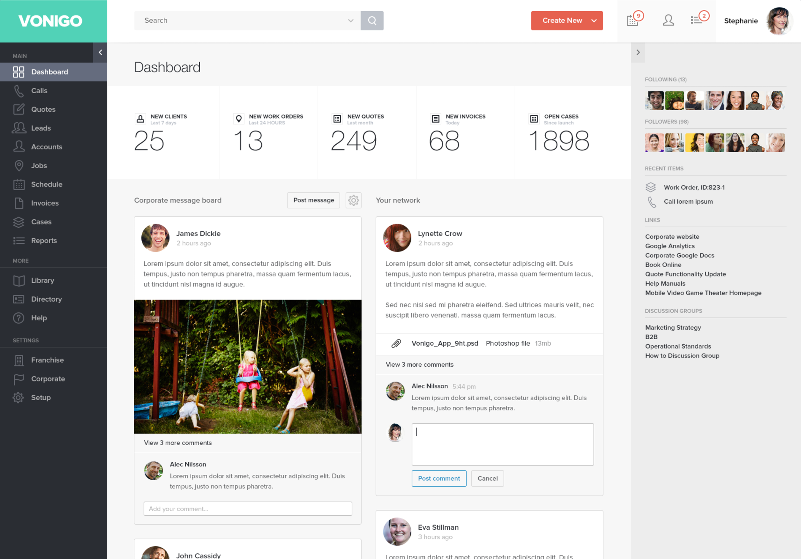

# Web design exercise

This UI was built with Angular v1.6 and CSS3 flexbox model layout. It translates the below dribble interface into a web page.



## Getting Started

Follow these instructions to get a copy of the project up and running on your local machine.

### Prerequisites

To run this project you need the following software installed on your system:

* [node.js and npm](https://nodejs.org/en/). Run `node -v` and `npm -v` on the terminal window to check if you have node and npm.

* [gulp cli](https://github.com/gulpjs/gulp/blob/master/docs/getting-started.md). Run `gulp -v` on the terminal window to check if you have gulp-cli.

* [ruby](https://www.ruby-lang.org/en/downloads/). Run `ruby -v` on the terminal window to check if you have ruby (macs come with a ruby installation).

* [sass](http://sass-lang.com/install). Run `sass -v` on the terminal window to check if you have sass (sass is a ruby gem; you need to have ruby on your system before you install sass).


### Installation

Open a terminal window and:

```bash
$ cd ~/Sites #or wherever you keep your projects

$ git clone https://github.com/Naxus28/message-board-user-interface.git

$ cd message-board-user-interface

$ npm install #npm postinstall will run bower install and serve app on port 3000 (http://localhost:3000)
```

## Gulp Files

* `gulp.config.js` has all configuration code used on gulp tasks

* `gulp.babel.js` has all gulp tasks 


## Gulp serve

Gulp is configured to build a ".tmp" directory and serve files from "/src", "/.tmp", and "/bower_components" (this is a setup for a development environment)

#### build and serve app
```bash
$ gulp serve
```

__Note__: because gulp is setup to serve for development only there are no annotations on dependencies injected into controllers, directives, and services. This works fine because gulp is not minifying/uglifying code. However, if minification/uglification are implemented (say for a production server), either functions need to be annotated or [gulp-ng-annotate](https://www.npmjs.com/package/gulp-ng-annotate) needs to be installed and piped into the gulp tasks.

## Built With

[node and npm](https://nodejs.org/en/) - Package (dependencies) management

[bower](https://bower.io/) - Package (dependencies) management

[gulp](http://gulpjs.com/) - An automating tool to streamline the development workflow

[javascript](https://developer.mozilla.org/en-US/docs/Web/JavaScript) - The browser's native scripting language

[angularjs](https://angularjs.org/) - A javascript framework for frontend apps

[ui-router](https://github.com/angular-ui/ui-router) - A routing library for Angular apps

[lodash](https://lodash.com/) - A JavaScript utility library used for modularity and better performance

[sass](http://sass-lang.com/install) - CSS extension language


## Author

**Gabriel Ferraz** | Web Software Developer | gabrielferraz27@gmail.com
